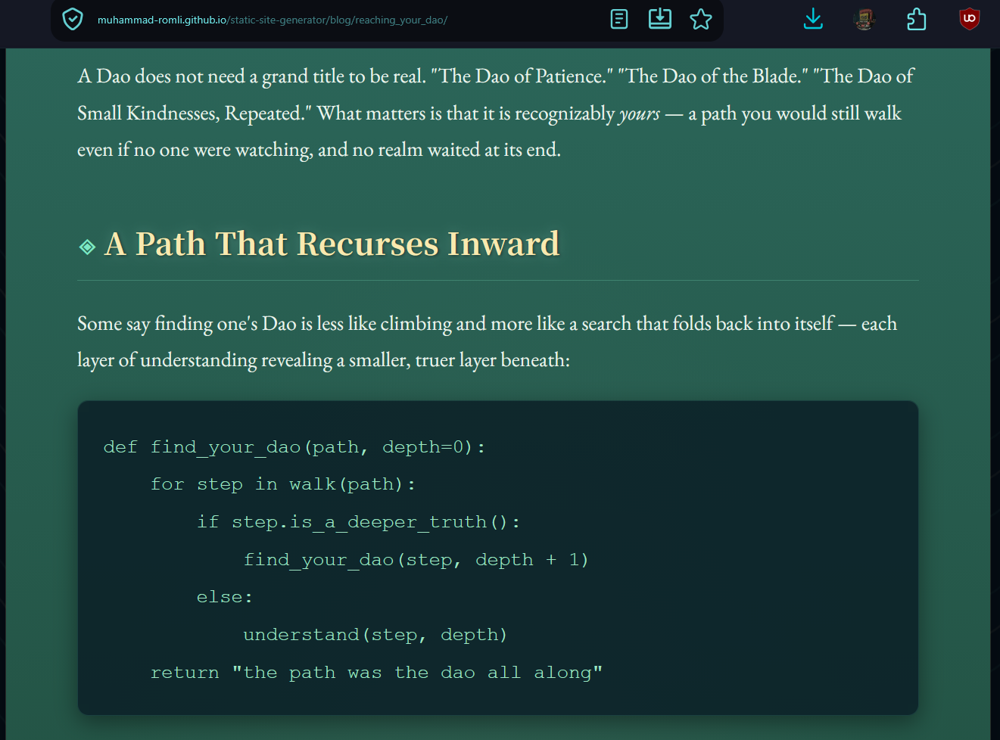
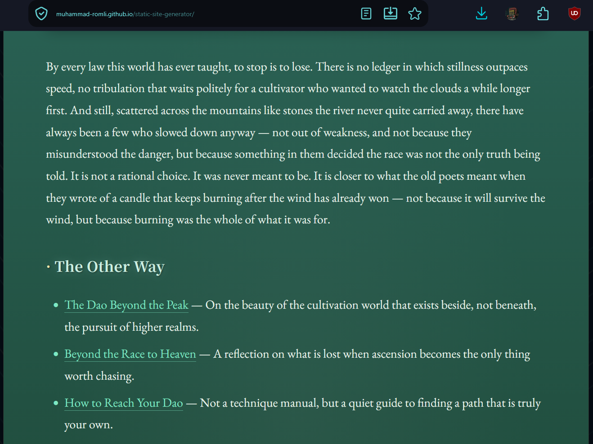

# Static Site Generator

A command-line tool that converts Markdown (a lightweight markup language) into HTML (the language browsers render). I built this project to practice data pipelines, parsing, regex, and general software design.

## Status: COMPLETED
🟢 FULLY COMPLETED 🟢
⚠️ This project is a learning exercise and is not intended for production use.

## Limitations
- Full nested inline parsing is not supported (e.g. `**_this_**`).
- Parentheses cannot be nested inside another parenthesis within a link or image URL.

## How to Use
- Configuration options are available in `main.py`.
- Run `main.sh` to serve the site locally.
- Run `build.sh` to build the site for GitHub Pages.

## Tech
- Python (standard library only, no external dependencies)
- Runs entirely offline and fast
- `main.sh` serves the site locally at `localhost:8888`

## Data Flow
1. The `static` folder's contents are copied recursively into the `public` directory. `index.css` is copied as-is, and `template.html` is prepared as the base template for the next step.
2. Every `.md` file in the `content` directory is recursively converted into an `.html` file, following steps 2.1–2.5:
   1. The Markdown file is split into blocks, each assigned a type, since HTML structures content the same way (e.g. code block, paragraph block, header block).
   2. Each block is split into `TextNode`s.
   3. Each `TextNode` is converted into an `HTMLNode`.
   4. Each `HTMLNode` is converted into HTML code, depending on whether it's a `ParentNode` or a `LeafNode`.
   5. This process repeats for every `.md` file, and the output is copied into the `docs` folder (or a custom folder, configurable in `main.py`).

## Screenshots

## Preview
https://muhammad-romli.github.io/static-site-generator/